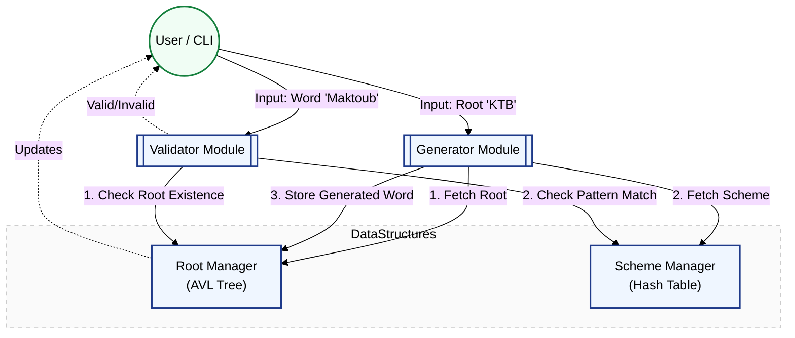

# Global System Architecture

```mermaid
%%{init: {'theme': 'base', 'darkMode': false, 'themeVariables': { 'primaryTextColor': '#000000', 'edgeLabelTextColor': '#000000', 'lineColor': '#000000', 'background': '#ffffff', 'mainBkg': '#ffffff'}}}%%
graph TD
    %% Global System Architecture
    classDef system fill:#eff6ff,stroke:#1e3a8a,stroke-width:2px,color:#000000;
    classDef storage fill:#fff7ed,stroke:#c2410c,stroke-width:2px,color:#000000;
    classDef user fill:#f0fdf4,stroke:#15803d,stroke-width:2px,color:#000000;

    User(("User / CLI")):::user
    RootManager["Root Manager\n(AVL Tree)"]:::system
    SchemeManager["Scheme Manager\n(Hash Table)"]:::system
    Generator[["Generator Module"]]:::system
    Validator[["Validator Module"]]:::system

    User -->|Input: Root 'KTB'| Generator
    User -->|Input: Word 'Maktoub'| Validator

    Generator -->|1. Fetch Root| RootManager
    Generator -->|2. Fetch Scheme| SchemeManager
    Generator -->|3. Store Generated Word| RootManager

    Validator -->|1. Check Root Existence| RootManager
    Validator -->|2. Check Pattern Match| SchemeManager

    RootManager -.->|Updates| User
    Validator -.->|Valid/Invalid| User

    subgraph DataStructures
        style DataStructures fill:#fafafa,stroke:#ccc,stroke-dasharray: 5 5,color:#000000
        RootManager
        SchemeManager
    end
```
