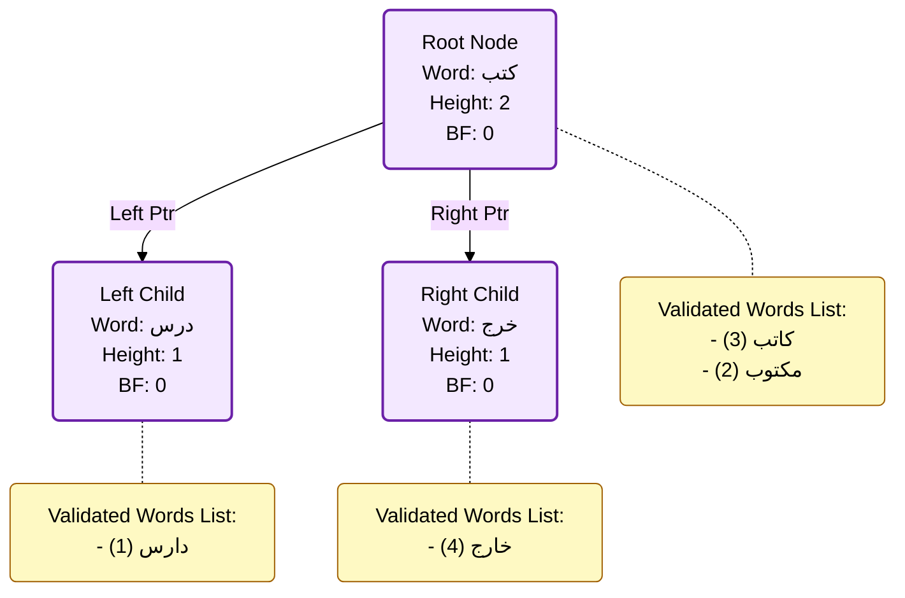

# AVL Tree Structure

```mermaid
%%{init: {'theme': 'base', 'darkMode': false, 'themeVariables': { 'primaryTextColor': '#000000', 'edgeLabelTextColor': '#000000', 'lineColor': '#000000', 'background': '#ffffff', 'mainBkg': '#ffffff'}}}%%
graph TD
    %% AVL Tree Structure
    classDef node fill:#f3e8ff,stroke:#6b21a8,stroke-width:2px,rx:5,ry:5,color:#000000;
    classDef list fill:#fef9c3,stroke:#a16207,stroke-width:1px,color:#000000;
    classDef pointer stroke:#94a3b8,stroke-dasharray: 5 5,color:#000000;

    RootNode["Root Node\nWord: كتب\nHeight: 2\nBF: 0"]:::node
    LeftChild["Left Child\nWord: درس\nHeight: 1\nBF: 0"]:::node
    RightChild["Right Child\nWord: خرج\nHeight: 1\nBF: 0"]:::node

    RootNode -- Left Ptr --> LeftChild
    RootNode -- Right Ptr --> RightChild

    ValidationList1["Validated Words List:\n- كاتب (3)\n- مكتوب (2)"]:::list
    ValidationList2["Validated Words List:\n- دارس (1)"]:::list
    ValidationList3["Validated Words List:\n- خارج (4)"]:::list

    RootNode -.- ValidationList1
    LeftChild -.- ValidationList2
    RightChild -.- ValidationList3
```
