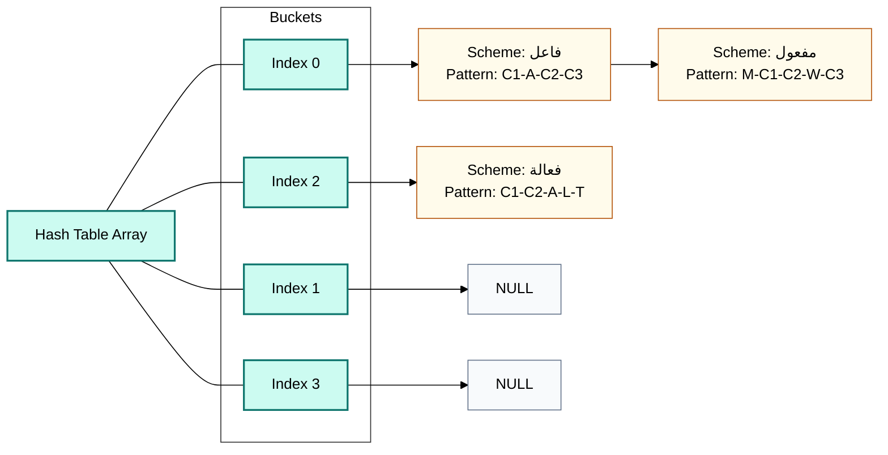

# Hash Table with Chaining

```mermaid
%%{init: {'theme': 'base', 'themeVariables': { 'primaryTextColor': '#000000', 'edgeLabelTextColor': '#000000', 'lineColor': '#000000'}}}%%
graph LR
    %% Hash Table with Chaining
    classDef bucket fill:#ccfbf1,stroke:#0f766e,stroke-width:2px,color:#000000;
    classDef entry fill:#fffbeb,stroke:#b45309,stroke-width:1px,color:#000000;
    classDef structure fill:#f8fafc,stroke:#64748b,stroke-width:1px,color:#000000;

    Header[Hash Table Array]:::bucket

    subgraph Buckets
        direction TB
        style Buckets fill:#ffffff,stroke:#333,color:#000000
        Bucket0[Index 0]:::bucket
        Bucket1[Index 1]:::bucket
        Bucket2[Index 2]:::bucket
        Bucket3[Index 3]:::bucket
    end

    Header --- Bucket0
    Header --- Bucket1
    Header --- Bucket2
    Header --- Bucket3

    %% Chain for Bucket 0
    SchemeA["Scheme: فاعل\nPattern: C1-A-C2-C3"]:::entry
    SchemeB["Scheme: مفعول\nPattern: M-C1-C2-W-C3"]:::entry
    Bucket0 --> SchemeA --> SchemeB

    %% Chain for Bucket 2
    SchemeC["Scheme: فعالة\nPattern: C1-C2-A-L-T"]:::entry
    Bucket2 --> SchemeC

    %% Empty buckets
    Bucket1 --> Null1[NULL]:::structure
    Bucket3 --> Null2[NULL]:::structure
```
