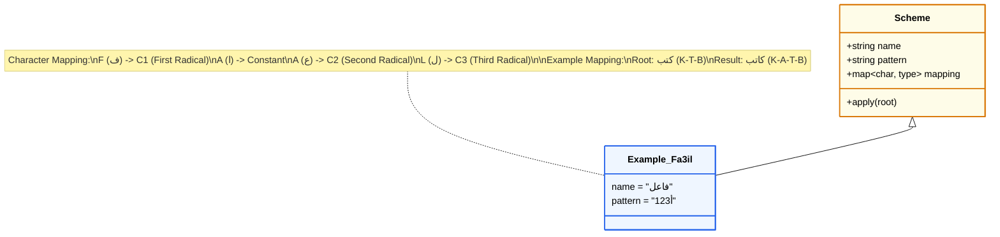

# Scheme Representation

```mermaid
%%{init: {'theme': 'base', 'darkMode': false, 'themeVariables': { 'textColor': '#000000', 'classText': '#000000', 'lineColor': '#000000', 'background': '#ffffff', 'mainBkg': '#ffffff'}}}%%
classDiagram
    %% Scheme Class Detail
    class Scheme {
        +string name
        +string pattern
        +map&lt;char, type&gt; mapping
        +apply(root)
    }
    style Scheme fill:#fefce8,stroke:#d97706,stroke-width:2px,color:#000000

    class Example_Fa3il {
        name = "فاعل"
        pattern = "1أ23"
    }
    style Example_Fa3il fill:#eff6ff,stroke:#2563eb,stroke-width:2px,color:#000000

    Scheme <|-- Example_Fa3il

    note for Example_Fa3il "Character Mapping:\nF (ف) -> C1 (First Radical)\nA (ا) -> Constant\nA (ع) -> C2 (Second Radical)\nL (ل) -> C3 (Third Radical)\n\nExample Mapping:\nRoot: كتب (K-T-B)\nResult: كاتب (K-A-T-B)"
```
