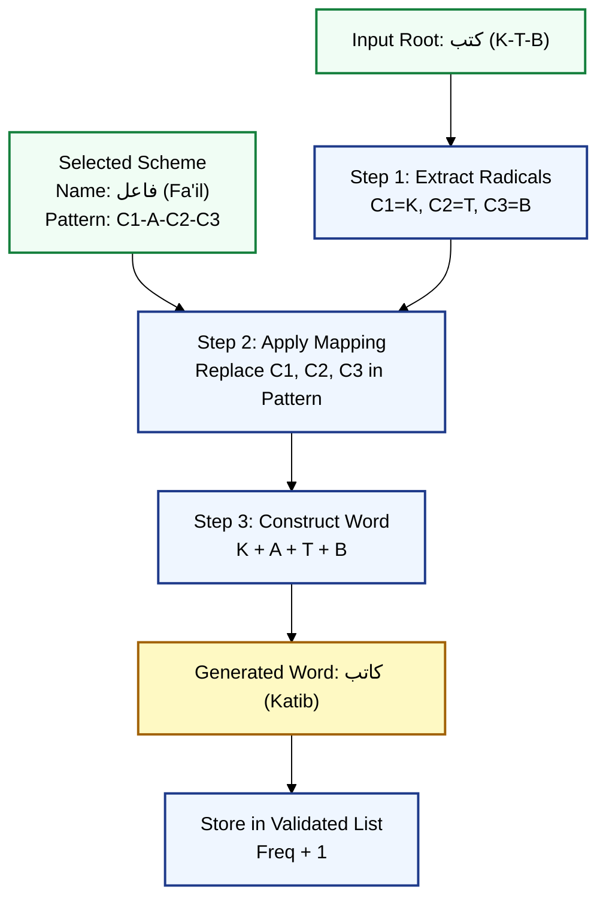

# Word Generation Process

```mermaid
%%{init: {'theme': 'base', 'themeVariables': { 'primaryTextColor': '#000000', 'edgeLabelTextColor': '#000000', 'lineColor': '#000000', 'background': '#ffffff'}}}%%
graph TD
    %% Word Generation Process
    classDef step fill:#eff6ff,stroke:#1e3a8a,stroke-width:2px,color:#000000;
    classDef data fill:#f0fdf4,stroke:#15803d,stroke-width:2px,color:#000000;
    classDef output fill:#fef9c3,stroke:#a16207,stroke-width:2px,color:#000000;

    InputRoot["Input Root: كتب (K-T-B)"]:::data
    InputScheme["Selected Scheme\nName: فاعل (Fa'il)\nPattern: C1-A-C2-C3"]:::data

    Step1["Step 1: Extract Radicals\nC1=K, C2=T, C3=B"]:::step
    Step2["Step 2: Apply Mapping\nReplace C1, C2, C3 in Pattern"]:::step
    Step3["Step 3: Construct Word\nK + A + T + B"]:::step

    Output["Generated Word: كاتب (Katib)"]:::output
    Store["Store in Validated List\nFreq + 1"]:::step

    InputRoot --> Step1
    InputScheme --> Step2
    Step1 --> Step2
    Step2 --> Step3
    Step3 --> Output
    Output --> Store
```
