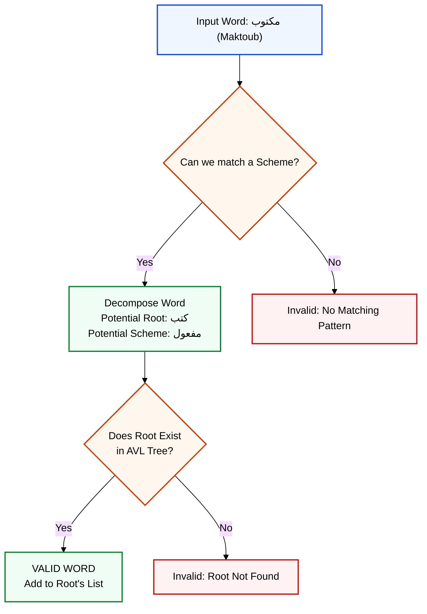

# Validation Process

```mermaid
%%{init: {'theme': 'base', 'themeVariables': { 'primaryTextColor': '#000000', 'edgeLabelTextColor': '#000000', 'lineColor': '#000000'}}}%%
graph TD
    %% Validation Process
    classDef check fill:#fff7ed,stroke:#c2410c,stroke-width:2px,color:#000000;
    classDef result fill:#f0fdf4,stroke:#15803d,stroke-width:2px,color:#000000;
    classDef error fill:#fef2f2,stroke:#b91c1c,stroke-width:2px,color:#000000;
    classDef input fill:#eff6ff,stroke:#1d4ed8,stroke-width:2px,color:#000000;

    InputWord["Input Word: مكتوب (Maktoub)"]:::input

    CheckScheme{"Can we match a Scheme?"}:::check
    Decompose["Decompose Word\nPotential Root: كتب\nPotential Scheme: مفعول"]:::result
    CheckRoot{"Does Root Exist\nin AVL Tree?"}:::check

    InputWord --> CheckScheme
    CheckScheme -- Yes --> Decompose
    CheckScheme -- No --> Invalid1["Invalid: No Matching Pattern"]:::error

    Decompose --> CheckRoot
    CheckRoot -- Yes --> Valid["VALID WORD\nAdd to Root's List"]:::result
    CheckRoot -- No --> Invalid2["Invalid: Root Not Found"]:::error
```
