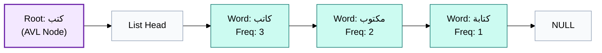

# Root Node Data Structure

```mermaid
%%{init: {'theme': 'base', 'themeVariables': { 'primaryTextColor': '#000000', 'edgeLabelTextColor': '#000000', 'lineColor': '#000000', 'background': '#ffffff'}}}%%
graph LR
    %% Root Node List
    classDef rootNode fill:#f3e8ff,stroke:#6b21a8,stroke-width:2px,color:#000000;
    classDef wordItem fill:#ccfbf1,stroke:#0f766e,stroke-width:1px,color:#000000;
    classDef structure fill:#f8fafc,stroke:#94a3b8,stroke-width:1px,color:#000000;

    RootContainer["Root: كتب\n(AVL Node)"]:::rootNode

    Word1["Word: كاتب\nFreq: 3"]:::wordItem
    Word2["Word: مكتوب\nFreq: 2"]:::wordItem
    Word3["Word: كتابة\nFreq: 1"]:::wordItem

    RootContainer --> ListHead[List Head]:::structure
    ListHead --> Word1
    Word1 --> Word2
    Word2 --> Word3
    Word3 --> Null[NULL]:::structure
```
