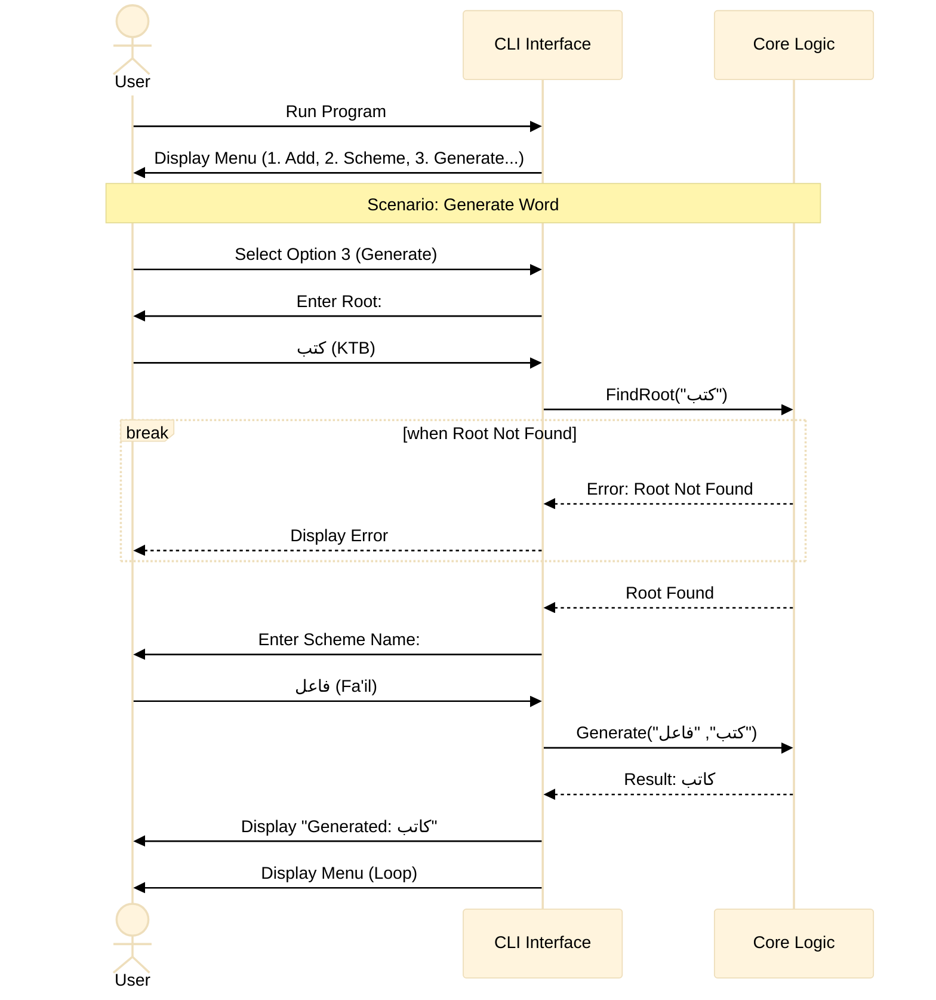

# CLI Interaction Flow

```mermaid
%%{init: {'theme': 'base', 'themeVariables': { 'textColor': '#000000', 'actorTextColor': '#000000', 'signalTextColor': '#000000', 'noteTextColor': '#000000', 'loopTextColor': '#000000', 'lineColor': '#000000'}}}%%
sequenceDiagram
    %% CLI Interaction
    actor User
    participant CLI as CLI Interface
    participant Logic as Core Logic

    User->>CLI: Run Program
    CLI->>User: Display Menu (1. Add, 2. Scheme, 3. Generate...)

    Note over User, Logic: Scenario: Generate Word

    User->>CLI: Select Option 3 (Generate)
    CLI->>User: Enter Root:
    User->>CLI: كتب (KTB)
    CLI->>Logic: FindRoot("كتب")

    break when Root Not Found
        Logic-->>CLI: Error: Root Not Found
        CLI-->>User: Display Error
    end

    Logic-->>CLI: Root Found

    CLI->>User: Enter Scheme Name:
    User->>CLI: فاعل (Fa'il)
    CLI->>Logic: Generate("كتب", "فاعل")
    Logic-->>CLI: Result: كاتب

    CLI->>User: Display "Generated: كاتب"
    CLI->>User: Display Menu (Loop)
```
